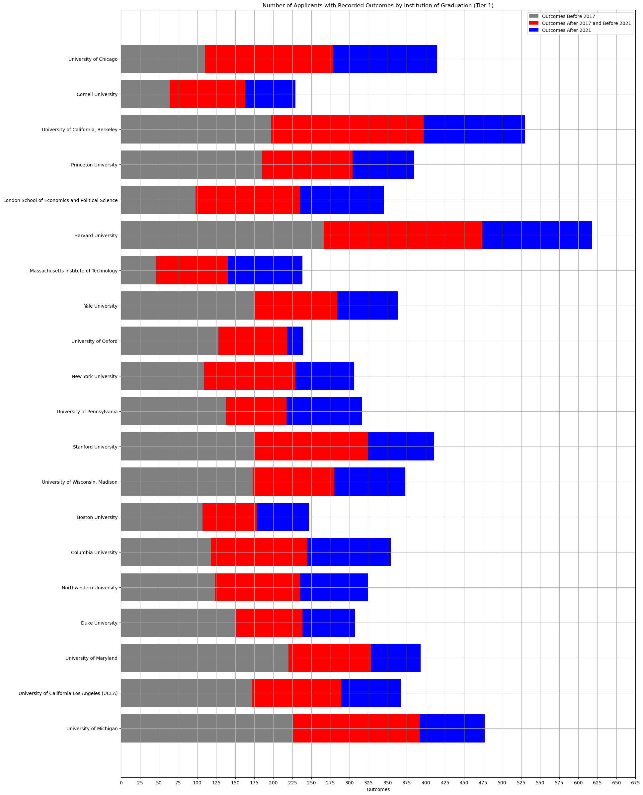
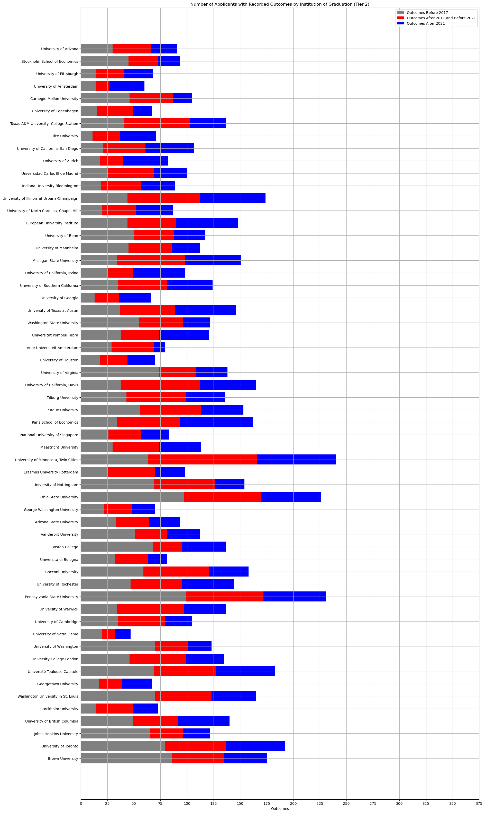
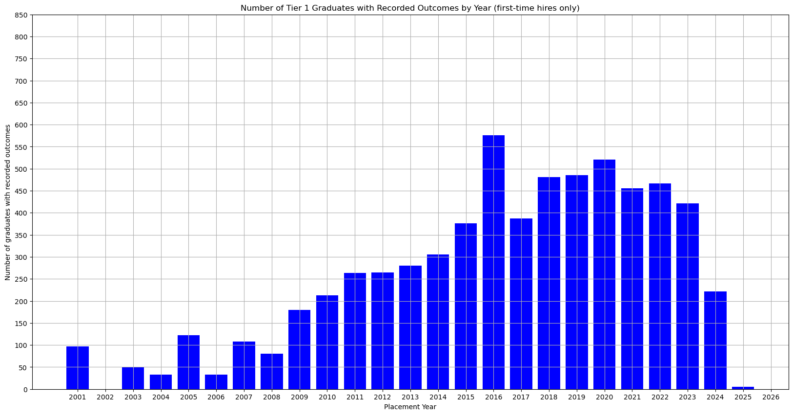
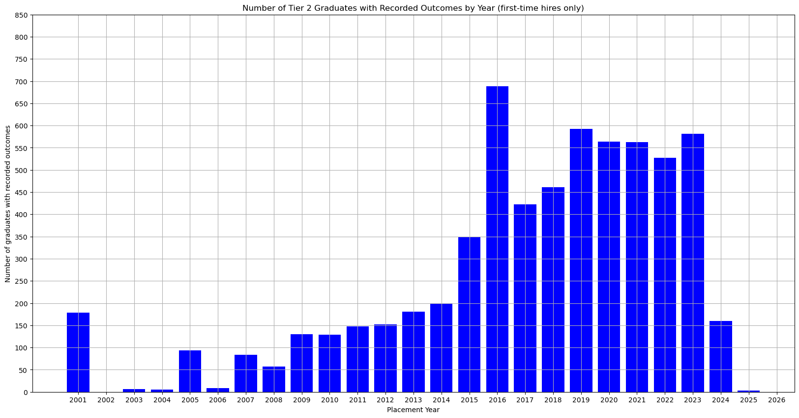
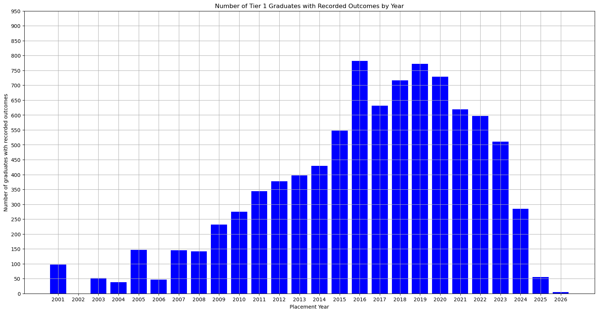
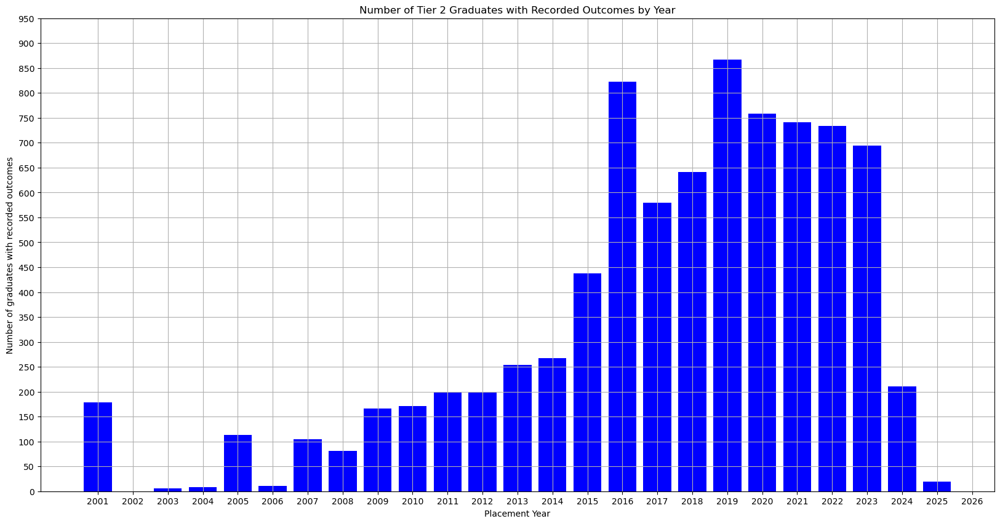

# Economics Ph.D. Job Placement Data 2024 Update
*Wuyang Ren*\
*August 2, 2024* 

## Coverage

### Number of Applicants with Recorded Outcomes

    The number of tier 1 and 2 institutions is 20 and 58 respectively

#### Tier 1

    

    

#### Tier 2

    

    

### Graduates by Year: First-Time Hires

#### Tier 1

    

    

#### Tier 2

    

    

### Graduates by Year: All Hires

#### Tier 1

    

    

#### Tier 2

    

    

