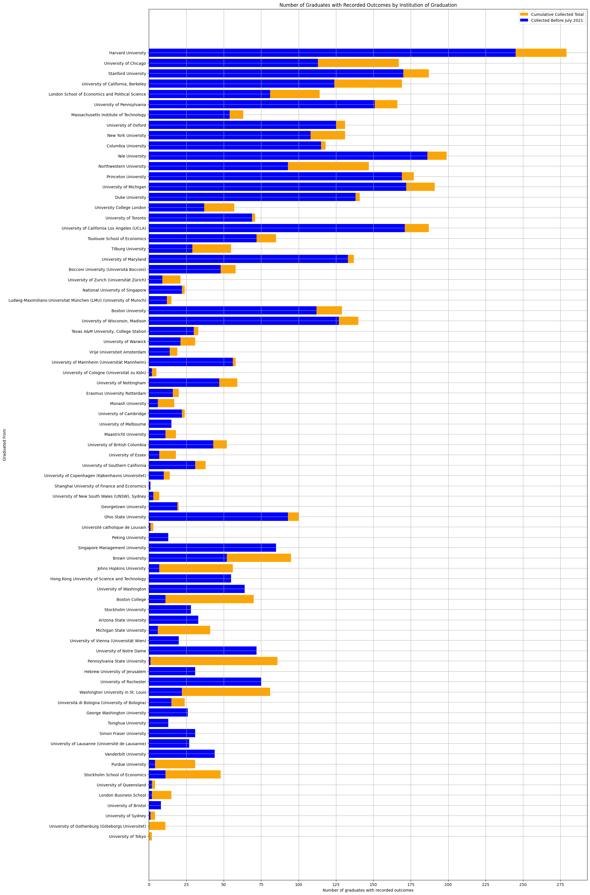
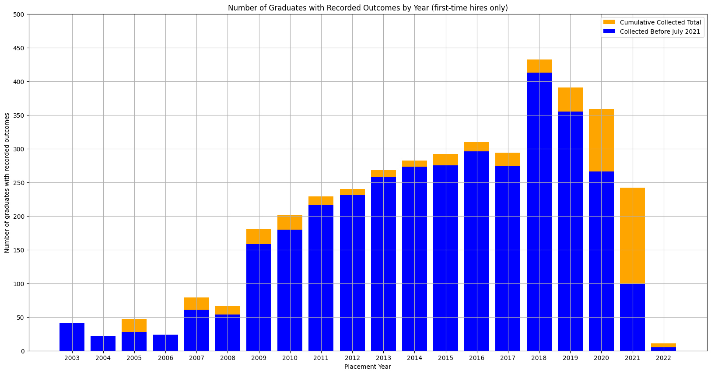
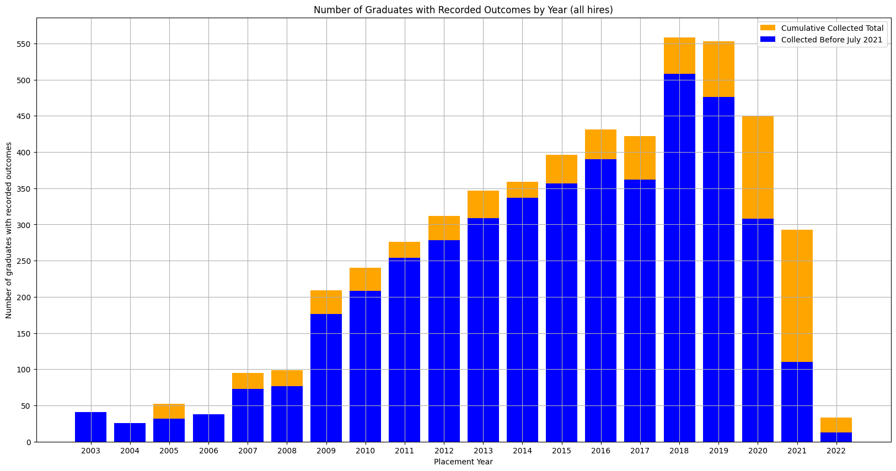

# Economics Ph.D. Job Placement Data
> **Author**
- [Amedeus Akira Dsouza, Vancouver School of Economics](https://aadsouza.github.io)

> **Contributors**

__From the Vancouver School of Economics:__
- Munkhzaya Baatarzaya
- Alexandra Bennett
- Abby Bu
- Alex Dong
- Wu Frank
- [Felipe Grosso](https://www.linkedin.com/in/felipe-grosso/)
- Kuhu Gupta
- Jonah Heyl
- Felix Huang
- Eric Leung
- Caroline Luo
- Wenxin Ma
- Sarah Maham Malik
- Maria Ines Moran
- Huitong Niu
- [Michael Peters](https://montoya.econ.ubc.ca)
- Soren Rajani
- Yongli Shi
- Katherine Swander
- Jin Wang
- Hongkai Yu
- [James Yuming Yu](https://github.com/jbrightuniverse)
- Ziheng Zhao

__From the University Transition Program (UBC):__
- Jonathan Chan
- Alisa Mandlis
- James Thom
- Jacky Xue
- Michael Yang
- Sarah Yu

__From Other Departments and Organizations:__
- Aidan Russell Lim Chua, UBC Arts
- Alexandra Cooke, UBC Linguistics (Alumni)
- Katherine Feng, UBC Science
- Saul George, UBC Science
- Floria Gu, UBC Dept. of Computer Science
- Aarim Khan, McGill Economics
- Karen Liu, Sauder School of Business
- Jonathan Nah, UBC Science
- Yingying Wang, Sauder School of Business
- Kieran Weaver, UBC Dept. of Computer Engineering
- Kaiqian Yang, UBC Science
- Natalie Yuan, UBC Arts
- Kaijue Zhao, Sauder School of Business
- Ying Zeng, UBC Arts

On this dashboard we present geodetic plots that show the flows of Ph.D. graduates' placements. We sourced publically available data on the placements of Ph.D. graduates, including the institution where each applicant graduated from and the institution where they found a job. We added horizontal position representations (specifically latitudes and longitudes) to each of the institutions. It is worth noting that, in the summary charts below, we focus on institutions with economics departments ranked in the top 100 according to [rankings compiled by Tilburg University](https://econtop.uvt.nl/rankinglist.php) in 2016.

We organize the maps by four categories: institution where the appliant graduated from, their primary specialization, type of position, and placement year. Notice that the dropdown allows you to select a basket of institutions for which you'd like the map to be generated. Below the map, the same data is presented as a table for convenience.

## Data Limitations

The limitations of the data include:
- Certain institutions do not publish placement lists with names. We are working on searching for these applicants through LinkedIn profiles, professional websites, and published resumes and curricula vitae. Thus, regression analyses may be susceptible to selection bias. Please refer to the barplots in the next section to learn more about the coverage of the data.
- Plots converging in the Gulf of Guinea at the intersection of the Equator and the Prime Meridian are institutions for which we currently do not have horizontal position representations.
- The population of graduates from institutions outside the United States, Canada, and Western Europe are underrepresented in the sample.
- Recruiter types are self reported by the institutions.
- There may be ambiguity in the assignment of positions. In particular, "Lecturers" at certain institutions - in particular European institutions - are indeed "Assistant Professors". Similarly, there are instances of ambiguity between "Post-Docs" and Visiting Assistant Professors, the latter of which are classified as "Visiting Professor/Lecturer/Instructor". Instructors and Assisant Professors of Teaching are classified as "Visiting Professor/Lecturer/Instructor", "Lecturer", or "Assistant Professor".
- Rankings are currently only assigned to a single department in an institution.
- Applicants whose department of academic placement is ambiguous, or not present in the database, have been assigned by default to the Economics department of said institution, if this department exists. If not, they have been assigned to the first listed department.
- For private institutions with multiple branches, the assignment of horizontal position representation does not necessarily accurately reflect branch of placement.
- Some applicants may have graduated from an institution where they were awarded an undergraduate or Master's degree rather than a Ph.D. While the vast majority of placements are of Ph.D. graduates, there may be some which are not, and these rare exceptions are not explicitly indicated in the sample at this time.
- Placements at multinational corporations may have inaccurate location information. Specifically, all branches of a particular private sector organization may not be present in the dataset.
- Select outcomes erroneously display the hiring institution as the institution an applicant graduated from. The number of outcomes displaying this behaviour is not known at this time.
- A small number of outcomes correspond to applicants who were hired as research or teaching assistants during their Ph.D. program as opposed to after.
- A small number of outcomes, the majority of which were placements prior to 2018, exist in the database more than once.
- A small number of outcomes from 2006 and years prior to 2005 may be misreported as being placed in a different year. Notably, many 2006 entries are reported as 2007, and some pre-2005 entries are reported as either 2005 or 2022.

## Coverage

```python
import matplotlib.pyplot as plt
import os
import IPython
import mysql.connector as sql
import numpy as np
import warnings
warnings.filterwarnings('ignore')
from dotenv import load_dotenv
load_dotenv()
from collections import defaultdict

db_connection = sql.connect(host='127.0.0.1', database= os.environ.get("foodatabase"), user= os.environ.get("foousername"), password= os.environ.get("foopassword"))

db_cursor = db_connection.cursor(dictionary=True)

db_cursor.execute('select * from to_data t join from_data f on t.aid=f.aid where to_latitude is not null and latitude is not null and category_id in (1,2,6,7,10,12,13,15,16,23)')

```


```python
data_pre = defaultdict(set)
data_all = defaultdict(set)
var = db_cursor.fetchall()
rankmapper = {}
for entry in var:
    if entry["from_institution_name"] not in rankmapper or entry["rank"] != None:
        rankmapper[entry["from_institution_name"]] = entry["rank"]

for entry in var:
        if rankmapper[entry["from_institution_name"]] and rankmapper[entry["from_institution_name"]] <= 100 and rankmapper[entry["from_institution_name"]] > 0:
        #by institution name - multiple oid for same name
            data_all[entry["from_institution_name"]].add(entry["aid"])
            if "2021-07" not in str(entry["created_at"]):
                data_pre[entry["from_institution_name"]].add(entry["aid"])

fig, ax = plt.subplots(figsize = (20, 40))

institutions = list(data_all.keys())
institutions.sort(key = lambda x: rankmapper[x] if rankmapper[x] else 101)
data_all_processed = [len(data_all[i]) for i in institutions]
vticks = np.arange(len(institutions))
ax.barh(vticks, data_all_processed, align = "center", color = "orange", label = "Cumulative Collected Total")
ax.set_yticks(vticks)
ax.set_yticklabels([i for i in institutions])
ax.invert_yaxis()

old_inst = list(data_pre.keys())
old_inst.sort(key = lambda x: rankmapper[x] if rankmapper[x] else 101)
data_old_processed = [len(data_pre[i]) for i in old_inst]
yticks = np.arange(len(old_inst))
ax.barh(yticks, data_old_processed, align = "center", color = "blue", label = "Collected Before July 2021")


ax.set_title("Number of Graduates with Recorded Outcomes by Institution of Graduation - Top 100 Institutions")
ax.set_xlabel("Number of graduates with recorded outcomes")
ax.set_ylabel("Graduated From")
x_ticks = np.arange(0, 300, 25)
ax.set_xticks(x_ticks)
ax.legend()
ax.grid()
```





```python
data_pre = defaultdict(int)
data_all = defaultdict(int)
var = db_cursor.fetchall()

applicants = defaultdict(list)
for entry in var:
    if entry["rank"] and entry["rank"] <= 100 and entry["rank"] > 0:
        applicants[entry["aid"]].append((int(str(entry["startdate"])[:4]), str(entry["created_at"])))

for applicant in applicants:
    smallest_year = min(applicants[applicant], key = lambda x: x[0])
    data_all[smallest_year[0]] += 1
    if "2021-07" not in smallest_year[1]:
        data_pre[smallest_year[0]] += 1

fig, ax = plt.subplots(figsize = (20, 10))

years = list(data_all.keys())
years.sort()
data_all_processed = [data_all[i] for i in years]
ticks = np.arange(len(years))
ax.set_xticks(ticks)
ax.set_xticklabels(years)
ax.bar(ticks, data_all_processed, align = "center", color = "orange", label = "Cumulative Collected Total")

old_years = list(data_pre.keys())
old_years.sort()
data_old_processed = [data_pre[i] for i in old_years]
xticks = np.arange(len(old_years))
ax.bar(xticks, data_old_processed, align = "center", color = "blue", label = "Collected Before July 2021")

ax.set_xlabel("Placement Year")
ax.set_ylabel("Number of graduates with recorded outcomes")
y_ticks = np.arange(0, 550, 50)
ax.set_yticks(y_ticks)
ax.set_title("Number of Graduates with Recorded Outcomes by Year (first-time hires only)")
ax.legend()
ax.grid()
```





```python
data_pre = defaultdict(int)
data_all = defaultdict(int)
var = db_cursor.fetchall()

applicants = defaultdict(list)
for entry in var:
    if entry["rank"] and entry["rank"] <= 100 and entry["rank"] > 0:
        applicants[entry["aid"]].append((int(str(entry["startdate"])[:4]), str(entry["created_at"])))

for applicant in applicants:
    for year in applicants[applicant]:
        data_all[year[0]] += 1
        if "2021-07" not in year[1]:
            data_pre[year[0]] += 1

fig, ax = plt.subplots(figsize = (20, 10))

years = list(data_all.keys())
years.sort()
data_all_processed = [data_all[i] for i in years]
ticks = np.arange(len(years))
ax.set_xticks(ticks)
ax.set_xticklabels(years)
ax.bar(ticks, data_all_processed, align = "center", color = "orange", label = "Cumulative Collected Total")

old_years = list(data_pre.keys())
old_years.sort()
data_old_processed = [data_pre[i] for i in old_years]
xticks = np.arange(len(old_years))
ax.bar(xticks, data_old_processed, align = "center", color = "blue", label = "Collected Before July 2021")

ax.set_xlabel("Placement Year")
ax.set_ylabel("Number of graduates with recorded outcomes")
y_ticks = np.arange(0, 550, 50)
ax.set_yticks(y_ticks)
ax.set_title("Number of Graduates with Recorded Outcomes by Year (all hires)")
ax.legend()
ax.grid()
```





